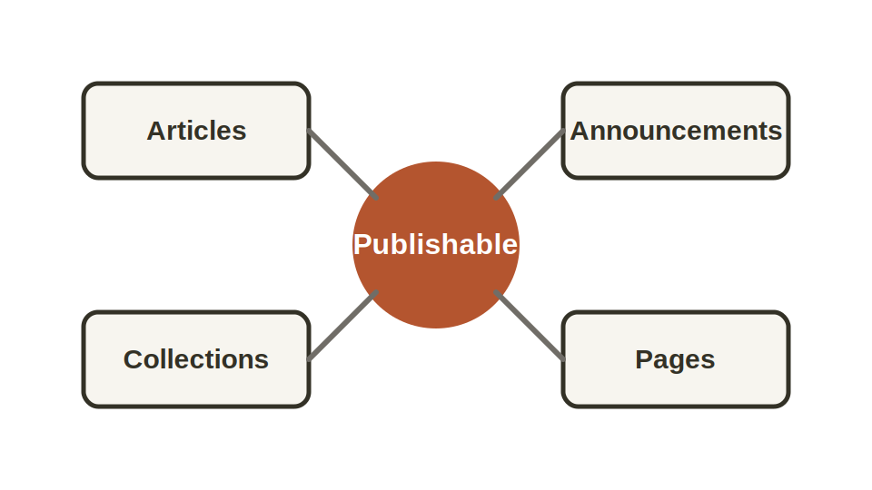

The author-facing model is intentionally small. Most site content is a
publishable entry, an editorial collection, or a standalone page.



## Publishable Entries

Articles and announcements share the same basic shape:

```yaml
---
title: Example Article
description: A concise summary for lists, feeds, and metadata.
date: 2026-05-08
author: Platform Team
tags:
  - example
---
```

The site config supplies defaults for draft state, visibility, feed inclusion,
search inclusion, and PDF eligibility. Authors only write exceptions.

## Collections

Collections are ordered editorial lists. They are useful for homepage features,
starter reading, series pages, and curated topics because the editor controls
the order without editing every article.

```yaml
---
title: Start Here
items:
  - quick-start
  - create-first-article
  - customize-homepage
---
```

## Pages

Standalone pages are for stable explanatory content such as the homepage,
about pages, and landing pages. They use Markdown frontmatter but do not appear
in article feeds.

## Next

Use [Articles](/articles/articles/) for ordinary posts,
[Announcements](/articles/announcements/) for update-style content, and
[Collections](/articles/collections/) when the order matters.
