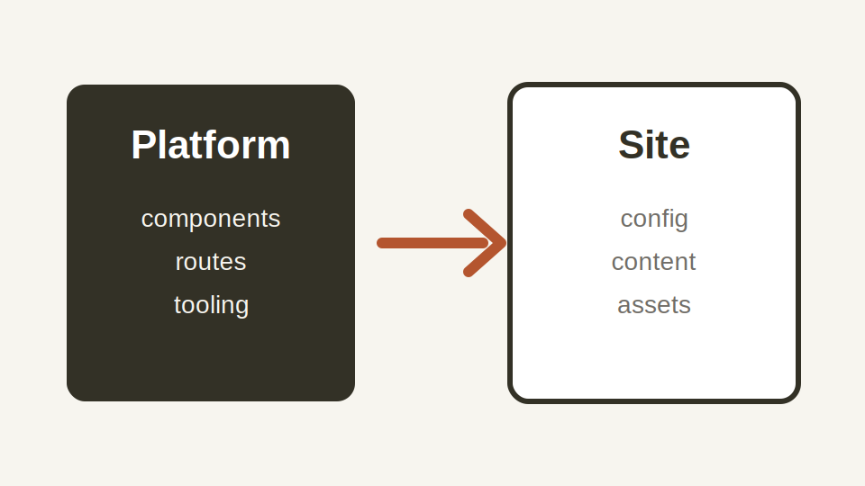

Site-owned images should live in the site instance so Astro can optimize and
fingerprint them.

## File Location

```text
site/assets/articles/<article-slug>/<image-file>
```

The docs site uses:

```text
examples/docs-site/assets/articles/quick-start/platform-map.svg
```

## Article Image

Reference a local image in frontmatter:

```yaml
---
image: ../../../assets/articles/quick-start/platform-map.svg
imageAlt: Diagram showing platform code connected to a site instance.
---
```

## Markdown Image

Use ordinary Markdown for body images:

```markdown

```

## Common Mistakes

- Put processable images under `site/assets`, not `site/public`.
- Always write useful alt text.
- Use `site/public` only for files that must be copied unchanged.

## Verify

```sh
bun run author:check
```
