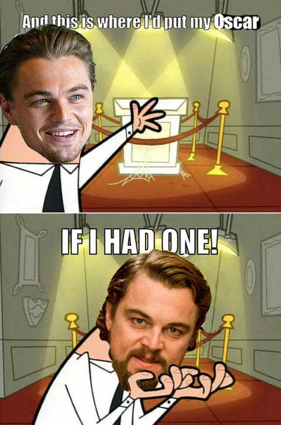
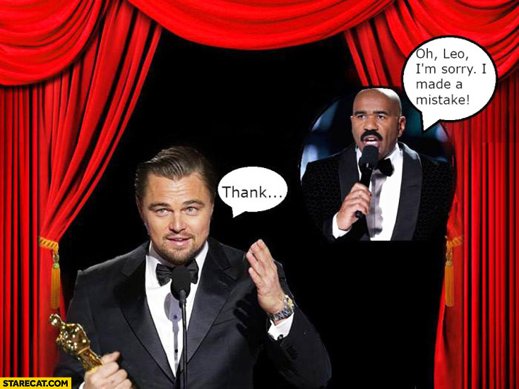
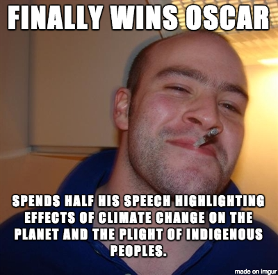
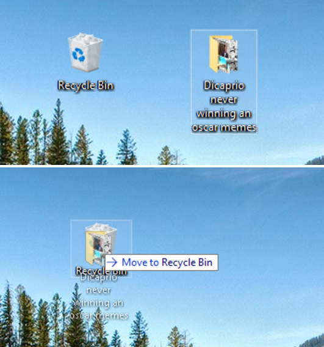

If you have an Internet connection, then you must have noticed how Leonardo DiCaprio’s face and name have infected your computer like some celebratory virus. Everyone is talking about Leo. Even the media is [talking about how everyone is talking about Leo](http://www.dailymail.co.uk/tvshowbiz/article-3469076/Leo-DiCaprio-sends-wave-relief-internet-Oscar-memes-erupt.html) (and here I am, responding to this ironically by talking about Leo).

The anticipated explosion is not merely from Leo’s Oscar ‘impotence’, it is the result of it. Due to years of continual memeing about Leo’s shortcomings, an interesting question has arisen among the meme community. Is Leo’s Academic success also the death of a meme? Jokingly, Redditor /u/exatron captioned a post-Oscar meme, “[The meme didn’t die, it just changed form](https://www.reddit.com/r/AdviceAnimals/comments/48a9sj/the_meme_didnt_die_it_just_changed_form/)”. Though the original intent was to tease Leo and imply his struggle for an Academy Award was not over, /u/exatron’s two-line joke stirs us with an additional line of thought: _When a meme is related to a real life circumstance, does it die if the circumstance changes?_

There is obviously a death of sorts. Though DiCaprio will continue with his career, the hype surrounding any future nominations will be considerably less than in years previous. Memes anchored in real life grow increasingly stale as the news and the punch lines become all too familiar. Leo’s victory will become out-dated: Current post-Oscar memes act as simple reminders of the win and any return of the meme (which might result from a new nomination) would find its comedic effect diminished with each passing year.

Does that mean the death of Leo’s Oscar memes has already happened? In a [previous essay](https://thomasrososchansky.wordpress.com/2015/05/28/essay-on-pepe-and-the-cotard-delusion/) I tackled the Schrödinger status of Pepe deemed at once both alive and dead. One of the main signs of his (partial) death was the declaration from the 4chan community that Pepe’s presence in normie circles was some kind of killing, murder, or merely a figurative death via his loss of innocence; this labelling stemmed from their agitation over the meme becoming what I termed a ‘not-so-inside-joke’. In contrast, there is no definitive end (yet)of Leo’s objectification in memes, only a new beginning in which the narrative continues–even as we sense the ending coming ever closer.

An interesting similarity between Leo and Pepe is the opportunity their deaths create to use them in new ways; their future will perhaps be illustrative of the [different life cycles of memes](/articles/glossary-1-dot-0/#ThePhylomemeticTree). I mentioned that Pepe’s ‘death’ allowed for his image to be used ironically by oldfags, as well as to be presented like a corpse to symbolise dying or death, and it may thus be that the end of Leo’s misfortune is the beginning of his triumph, with the succession of memes criticising his win becoming the new trend. Because the focus is still on Leo, the meme is evolving along with the narrative: the subject is the same, only developed, and the style seems to continue in the same approachable and pre-ironic form–memes which do not take memes, themselves, as the object of their humour.

To deny a death, however, does not mean we deny death completely. If the subject that keeps the meme alive is ‘The Oscars’, then there is definitely a foreseeable end to the meme. Whether it is in a few weeks time when this becomes old news or in several years when even joking about “that time Leo finally won” gets boring, repetition will drive the meme’s punch to the ground. Winning the Oscar has given the meme mortality, a life that can only be prolonged if the content were to find itself in the hands of Ironics, those memers who exploit the meme-as-object as a vector for ironic humour. But even then, like other history-related events such as 9/11, the keenness of repeating a known fact through humour will [grow progressively smaller](http://knowyourmeme.com/memes/events/september-11th-2001-attacks).

These questions about Leo’s meme ‘status’ emphasise how the lifespan of memes differs when they stem from different kinds of subject material. In the case of an ironic joke, meta- and post-irony will tend to find a place for it in new avenues of subversion, constantly revitalising the meme and perhaps even making its dormant state the joke that [brings it back to life](https://www.youtube.com/watch?v=3YxaaGgTQYM). In the case of a genuine occurrence (especially one that lacks any ‘edginess’ to substitute for shock or cringe value), the subversions become more difficult to imagine: the news gets old and the topic becomes repetitive and boring. The ‘Leo and the Oscars’ meme isn’t quite done yet, but its future seems bleak.
