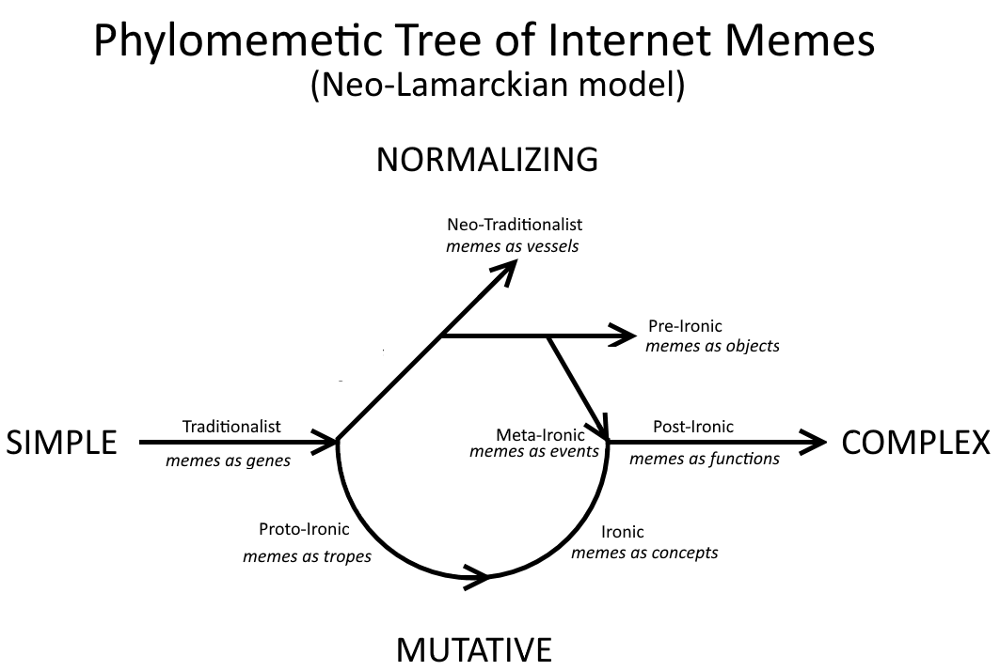
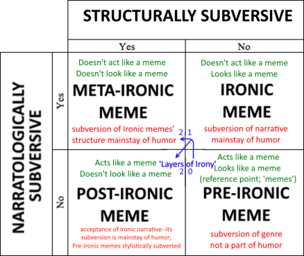

_Last updated Jan 18, 2016. A new glossary is being prepared; much of the following material is outdated!_

## Glossary 1.0

### Table of Contents

- [Autist](#Autist)
- [Ironic Memes](#IronicMemes)
- [Ironist](#Ironist)
- [Meta-Ironic Memes](#MetaIronicMemes)
- [Mutation](#Mutation)
- [Narratological Subversion](#NarratologicalSubversion)
- [Neo-Traditionalist Memes](#NeoTraditionalistMemes)
- [Normalization](#Normalization)
- [Normie](#Normie)
- [Normification](#Normification)
- [Post-Ironic Memes](#PostIronicMemes)
- [Pre-Ironic Memes](#PreIronicMemes)
- [Proto-Ironic Memes](#ProtoIronicMemes)
- [Simplicity/Complexity](#SimplicityComplexity)
- [Structural Subversion](#StructuralSubversion)
- [Stylistic Subversion](#StylisticSubversion)
- [The Phylomemetic Tree](#ThePhylomemeticTree)
- [The Quadrant of Ironic Memes](#TheQuadrantofIronicMemes)
- [Traditionalist Memes](#TraditionalistMemes)

### Autist

Participant in the underground meme scene. A poster, fluent in the associated
linguaculture, who is able to recall (memorization of content), reproduce
(emulation of style) and reference (intertextual affectation) memes. Though
frequently used to describe posters lacking in social graces -- often
self-deprecatingly -- this specialized term is useful in its conceptual
opposition to ‘normie,’ as well as its evocation of particular thinking and
speaking patterns found on the autism spectrum.

### Ironic Memes

Slightly more Complex memes; requires a prior base familiarity with some
Pre-Ironic lexicon since the subversion of conventions is the primary source
of its humor. Eventually begins to regress into the same behaviours as
Pre-Ironic memes (see ‘the decay to the meme’), which is the solidification of
common practices into normative convention. This process is often referred to
as ‘normification’ or ‘normies stealing the memes’.

### Ironist

A subgroup of autists; insiders to the Ironic meme scene. Originated from
4chan but now largely centred around Facebook meme pages and groups.
Associated with the lineage of ironic, meta-ironic and post-ironic memes.
Their self-identification as social misfits, developed in reaction against
normies, popularized the terminological dichotomy of normies and autists.

Alternative spelling: (an) ironic

### Meta-Ironic Memes

Complex memes that prey on less complex memes; forms the same relationship
with the meme(s) it derives its humor from as Ironic memes do with Pre-Ironic
memes. They violate the structural conventions of the memes they reference.
They often fall into an infinite regress of successively more ‘meta’ memes
that make fun of slightly less Ironic memes, ad infinitum unto
incomprehensibility, when the normalization process cannot keep up with the
rate of deconstruction.

### Mutation

The process through which a meme is altered from its previous copy. It can be
accidental such as in the case of misspelling or misuse, or deliberate such as
in the case of Ironic memes; a primary mechanism through which memes evolve.
It is far more frequently beneficial to the meme’s survival than random
mutation is to genes. The Underground exerts a slightly stronger pressure
towards this than towards Normalization.

### Narratological Subversion

Violation of conventions regarding the plot, themes, or message of a meme. The
joke is about the content, as opposed to format.

### Neo-Traditionalist Memes

Intertextual memes which reference various traditionalistic memes. Their humor
comes from “inside” jokes. As traditionalist memes are popularized, they
become famous and familiar. From this ubiquity arise neo-traditionalist memes,
which function as Internet pop-culture references that become memes of their
own.

As they accumulate, traditionalist memes begin to form increasingly complex
networks within which emerge neo-traditionalist memes. Common examples include
phrases such as “longcat is long” or virtually every line from the flight
scene from The Dark Knight Rises.

### Normalization

The process through which a component becomes accepted as ‘normal’ in a given
culture. Commonly referred to as “becoming a meme”. Conventions which emerge
organically solidify into consistent styles and take on a normative character
(i.e. become grammatical rules). Both Underground and Mainstream memes develop
through this process of popularization which makes an initially novel
component conventional. The Mainstream exerts a much stronger pressure towards
this than towards mutation.

### Normie

An outsider to the underground meme scene. A poster who is uninitiated,
uninvested, and stylistically uninformed. Though most recently associated with
the posters of pre-ironic memes, the term was originally used by Internet
denizens to describe well-socialized, “healthy” people in opposition to
Ironists who self-identify as social outcasts.

Alternative spellings: “normalfags,” “Norman,” and other derivatives of “normal”

### Normification

(Not to be confused with Normalization.) The process through which all complex
memes constantly regress towards Simplicity; the decay to the meme. As a meme
becomes popular with those uninitiated to its cultural nuances, Simple
mutations which only superficially obey the stylistic conventions begin to
overtake more Complex pieces of the ‘same’ meme. An example is the way Ironic
memes lost their initially subversive function and began to behave in much the
same way as Pre-Ironic memes, thus making ‘Ironic memes’ a Pre-Ironic meme in
itself.

### Post-Ironic Memes

Highly Complex memes that reconcile Pre-Irony and Irony. Instead of outright
violating established conventions, the narrative works with the structure in
an internally consistent manner. They vary in meaning depending on whether the
observer is familiar with Ironic meme culture or not, and simultaneously
convey two layers of meaning. Unlike in the case of Ironic memes, it is not
irony (i.e. meaning the opposite of what is being said) that is missed when
the viewer lacks familiarity with the tropes involved. What you see is some of
what you get–but not all. Numerous factors such as the history and associated
nuance related to the meme’s stylistic choices can be taken into account to
add nuance to the meme.

The locus of humor in post-ironic memes is what sets it apart from simpler
memes: the absence of ironic subversion. The viewer requires a broad knowledge
of the memetic lexicon, especially regarding ironic memes, in order to fully
appreciate post-ironic memes. A simple rule of thumb for the identification of
post-ironic memes is whether the humor is in what is being left undone or
unsaid; this makes them more complex than other memes, as well as resistant to
normification.

### Pre-Ironic Memes

Simple memes; popular objects making up the lexicon of reference humor–what
you see is what you get. They do not rely on the violation of memetic
conventions for their humor. The majority of ‘normie’ memes fall into this
category. They are highly normative and stress the importance of ‘using the
meme right’.

### Proto-Ironic Memes

Slightly complex memes that reference themes and ideas rather than other memes
themselves. They differ from Neo-Traditionalist memes in that they isolate the
narrative of another meme to reference. Effectively Internet inside jokes.
(explain how these involve much more artistic license and freedom from
restrictive formats, but doesn’t quite go as far as it)

### Simplicity/Complexity

The size of the system of related memes referenced by a particular meme.
Insofar as a meme exists within a network of other memes and relies on those
other memes for much of its meaning. Despite being an object in its own right,
the majority of its meaning is not derived directly from its actual visual
composition but the numerous other memes (i.e. other classes of meme-objects)
which it denotes and the poster references. An important point of note is that
the majority of references on which the full meaning of a meme depends is not
even indirectly pointed at by any given meme. The observer must be already
familiar with the system within which the meme operates, through observation
or participation within the respective memetic languaculture.

### Structural Subversion

Deconstruction of the relationship between the meme and the convention of its
genre through deliberate misuse (viz. a criticism of formulaic conventions in
Ironic memes). Structural subversion questions the concept of convention and
in doing so violates the process of normalization itself rather than any
particular convention. This is a violation of conventions regarding
conventions and treats rules as either ‘normal’, something to be followed
(anticipated punchline), or broken (unexpected twist) for humor.

Meta-Ironic memes thus bring into question the way even subversive humor
becomes normalized and subject to rigid conventions–and ultimately attack the
principled divide between Ironic and Pre-Ironic memes. In Post-Ironic memes,
this same kind of subversion manifests as a tacit knowledge regarding nebulous
conventions which emerge and overlap between different kinds of memes.
Separated from narratological subversion, structural subversion can function
like a play on words taking advantage of ambivalence in meaning within a meme.

### Stylistic Subversion

Violation of conventions regarding the visual elements, graphic structure,
presentation, and manner/rhetoric of a meme. The joke is about the format, as
opposed to content.

### The Phylomemetic Tree

The Phylomemetic Tree is a diagram showing the evolution of Internet memes
from their inception as emoticons and chain e-mails through to increasingly
complex forms such as baneposting, with a focus on the effects of their
divergence into the mainstream and underground.

### The Quadrant of Ironic Memes

The Quadrant is a system aimed at the practical, easily applicable
classification and analysis of Internet Memes, with a focus on the inherent
tension within ‘Ironic’ memes.

### Traditionalist Memes

The most basic kinds of Internet memes; single cultural units which are copied
and reproduced, such as emoticons, viral videos and forwarded chain e-mails.
