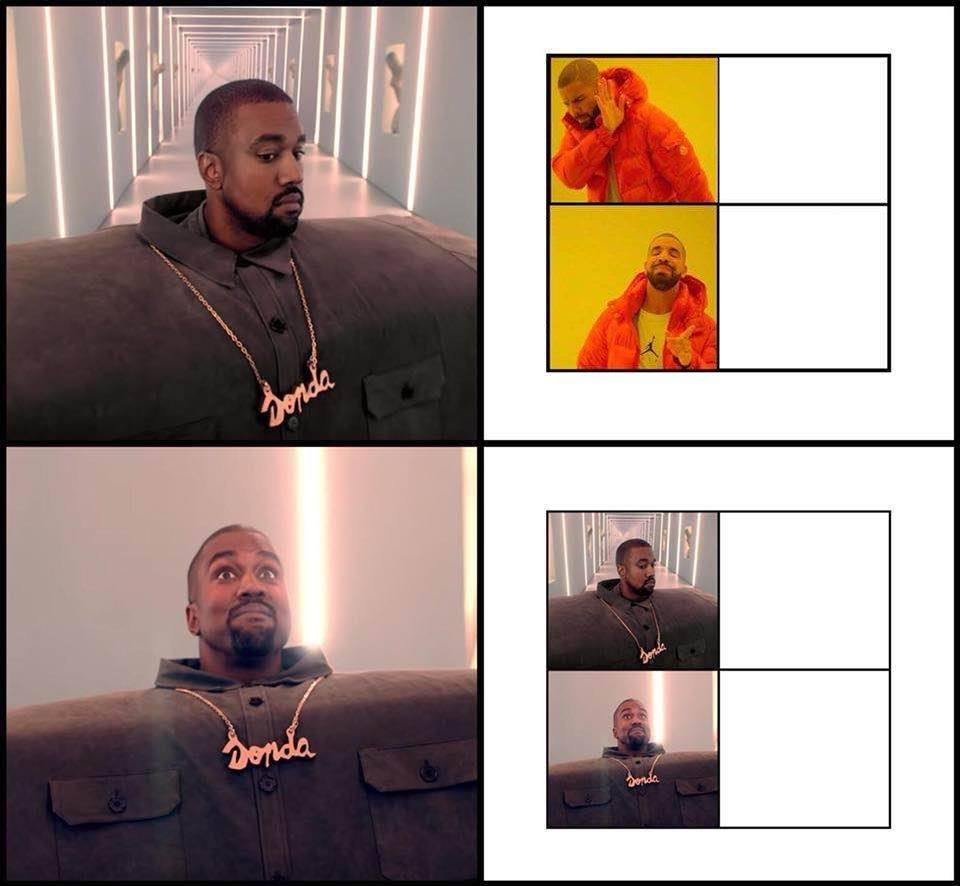
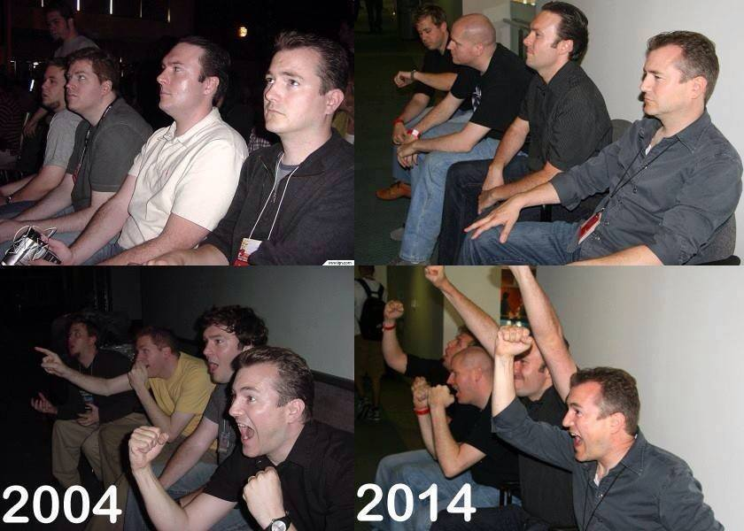
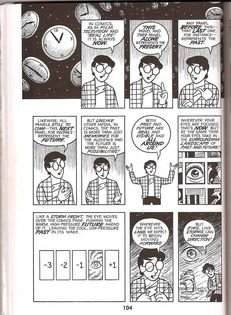
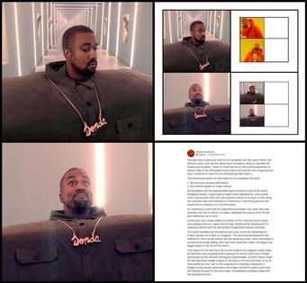

The joke here is obviously that the two templates are 'the same meme' with different styles, and that the Kanye-style template is about to overtake the Drake-style template. I think it's made funnier by the excited expression on Kanye's face in the third panel which makes him look like he's imagining how cool it would be to have his own template just like Drake's.

Two dimensions stand out that make the two templates the same:

1. the structure (aversion/affirmation)
2. the content (rappers in music videos)

But templates with the aversion/affirmation structure is one of the oldest templates around. It goes back at least to the Gaijin4Koma, a four-panel comic from around 2004 with IGN reporters sitting on a couch. In the meme, the reporters react with boredom to whatever is in the first panel and with excitement to whatever is in the third panel.

It's interesting to note that the Gaijin4Koma template was made and read vertically from top to bottom, in classic Japanese four-panel comic format, and understood as a comic.

Comics are very closely related to memes in form, and the remix culture surrounding comics in Japan has strongly influenced the development of Japanese memes and the descendant imageboard cultures overseas.
The Drake template and its relatives are more commonly interpreted by today's viewers as a table or a diagram. This structural development was reflected in other similar memes like the expanding brain, which developed a sub-genre involving adding more and more advanced states with bigger and bigger brains to the end of the meme.

One reason for the shift from the comics model to the diagram model might be that there was a gradual shift in general for meme culture from manga subcultures as the memetic techniques disseminated. Another reason might be that attaching multiple images to one post is common and easy to do on many platforms now, and so the experience of viewing a sequence of images is less closely associated with images divided by gutters and more with flicking through for the next image. Smartphones probably influenced this development too.

# Selected Comments

### Thread 1

_Conner Schultz_:

sorry, what exactly is the difference between the comic structure and diagram structure? just the addition of more panels beyond 4?

_Daniel Mourad_:

A comic reads like a comic (with a specific panel order) while a diagram reads like a diagram (which you can dissect starting from wherever you want)

_Seong-Young Her_:

Daniel has it right. A diagram's meaning doesn't necessarily change as the viewer progresses through from the start to the end, although I can think of plenty of examples that expressly achieve this, such as flow charts. Comics are 'sequential art' and their panel order matters a lot.

### Thread 2

_Beau Horenberger_:

I also feel like illustrated panel memes are more liable to be interpreted as comics, whereas I don't know of many screenshot-based memes that are intuitively comic-like

_Beau Horenberger_:

Oh but on googling I guess Gaijin 4koma is a direct counterexample

_Seong-Young Her_:

I can't say for certain but older screenshot memes tended to be more comics-like. Screenshot based memes became a lot more prevalent since screenshotting and rapid image captioning (not necessarily editing) became convenient. Think about how new Spongebob memes are usually single-screenshot but older (or older style) Spongebob memes are often multiple screenshots put together in a comics arrangement.

### Thread 3

_Leandro Vieira Steffen_:

for real though... good thinking

(Originally posted to [Diagram Memes](https://www.facebook.com/groups/diagrammemes/posts/490042968136817))
