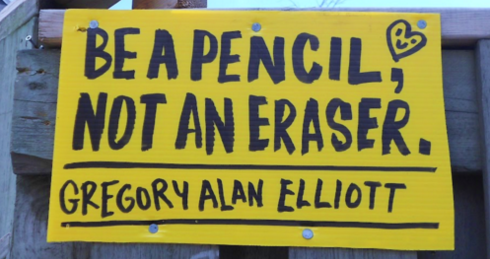

import HoverImageLink from "../../../components/articles/HoverImageLink.astro";
import articleImage01 from "../../../assets/articles/social-media-freedom/gae1.png";
import articleImage02 from "../../../assets/articles/social-media-freedom/gae2.png";
import articleImage03 from "../../../assets/articles/social-media-freedom/gae3.png";
import articleImage04 from "../../../assets/articles/social-media-freedom/gae4.png";
import articleImage05 from "../../../assets/articles/social-media-freedom/gae5.png";
import articleImage06 from "../../../assets/articles/social-media-freedom/gae6.png";
import articleImage07 from "../../../assets/articles/social-media-freedom/gae7.png";
import articleImage08 from "../../../assets/articles/social-media-freedom/gae8.png";
import articleImage09 from "../../../assets/articles/social-media-freedom/gae9.png";
import articleImage10 from "../../../assets/articles/social-media-freedom/gae10.png";
import articleImage11 from "../../../assets/articles/social-media-freedom/gae11.png";
import articleImage12 from "../../../assets/articles/social-media-freedom/gae12.png";
import articleImage13 from "../../../assets/articles/social-media-freedom/gae13.png";
import articleImage14 from "../../../assets/articles/social-media-freedom/gae14.png";
import articleImage15 from "../../../assets/articles/social-media-freedom/gae15.png";
import articleImage16 from "../../../assets/articles/social-media-freedom/gae16.png";
import articleImage17 from "../../../assets/articles/social-media-freedom/gae17.png";
import articleImage18 from "../../../assets/articles/social-media-freedom/gae18.png";
import articleImage19 from "../../../assets/articles/social-media-freedom/gae19.png";
import articleImage20 from "../../../assets/articles/social-media-freedom/gae20.png";
import articleImage21 from "../../../assets/articles/social-media-freedom/gae21.png";
import articleImage22 from "../../../assets/articles/social-media-freedom/gae22.png";
import articleImage23 from "../../../assets/articles/social-media-freedom/gae23.png";
import articleImage24 from "../../../assets/articles/social-media-freedom/gae24.png";
import articleImage25 from "../../../assets/articles/social-media-freedom/gae25.png";
import articleImage26 from "../../../assets/articles/social-media-freedom/gae26.png";
import articleImage27 from "../../../assets/articles/social-media-freedom/gae27.png";
import articleImage28 from "../../../assets/articles/social-media-freedom/gae28.png";
import articleImage29 from "../../../assets/articles/social-media-freedom/gae29.png";
import articleImage30 from "../../../assets/articles/social-media-freedom/gae30.png";
import articleImage31 from "../../../assets/articles/social-media-freedom/gae31.png";
import articleImage32 from "../../../assets/articles/social-media-freedom/gae32.png";
import articleImage33 from "../../../assets/articles/social-media-freedom/gae33.png";
import articleImage34 from "../../../assets/articles/social-media-freedom/gae34.png";
import articleImage35 from "../../../assets/articles/social-media-freedom/gae35.png";
import articleImage36 from "../../../assets/articles/social-media-freedom/gae36.png";
import articleImage37 from "../../../assets/articles/social-media-freedom/gae37.png";
import articleImage38 from "../../../assets/articles/social-media-freedom/gae38.png";
import articleImage39 from "../../../assets/articles/social-media-freedom/gae39.png";
import articleImage40 from "../../../assets/articles/social-media-freedom/gae40.png";
import articleImage41 from "../../../assets/articles/social-media-freedom/gae41.png";

_At the 2015 [NetGain](https://www.fordfoundation.org/the-latest/ford-live-events/netgain-working-together-for-a-stronger-digital-society/) conference hosted by The Ford Foundation, Tim Berners-Lee spoke at a lunch discussion titled "Celebrating 25 Years of the World Wide Web." During the Q&A a representative from the Anti-Discrimination League asked a blunt question: did he wish he had never invented the Web, since it had been used to spread so much hate?_

_I was ashamed, horrified, outraged. Lee's contribution is something of [divine](https://en.wikipedia.org/wiki/Tzimtzum) beauty and the challenge seemed insulting. The room was filled with both the bleeding edge of Internet radicals and the who's-who of cyber-libertarian heroes; I expected to see the crowd bristle, but it didn't. The sharp cynicism of the question and its tacit approval felt like a betrayal._

&nbsp;

If you aren't aware of the shitfight "culture war" that has been raging online over the past few years then you don't live here -- it has been impossible to avoid. Misogynists vs misandrists; Men's Rights Activists vs Feminists; GamerGaters vs Social Justice Warriors; /r/TheRedPill vs /r/ShitRedditSays; 4chan vs Tumblr. On every platform, in every community, the tensions run red-hot and the trolls from both sides have come out to play. Innocuous statements, as well as inflammatory shitposts, have led to the deployment of [Life Ruin Tactics](https://github.com/bibanon/bibanon/wiki/Ruin-Life-Tactics) from [shaming](http://www.nytimes.com/2015/02/15/magazine/how-one-stupid-tweet-ruined-justine-saccos-life.html) to [SWATing](http://kotaku.com/tag/swatting). Users today experience a textual violence unique to the 21st Century. While some call it exile or expulsion or just deserts, when users are forced to scrub all of their social media accounts to try and escape the hivemind it ought properly be called a digital murder.

Just as the political arena has turned towards the question of the constitutive 'we' of American society -- think Trump as the last gasp of the 1950s white, male, middle-class society or Black Lives Matter as its explosion -- the Internet denizens have turned towards a similar problem. Like the real world political arena, the citizens of cyberspace today confront not only the demand by abject groups for inclusion in the political body, but also the deficiencies in the structural and social governance of that body.

Yet the framing is all wrong. Undoubtedly there are ideologies at play, but the notion that the division is Right vs Left is a superficial read no matter how correlative it may sometimes seem. It is not the case that those arguing for "freedom of speech" online are reactionary, while those who seek to draw the line at "hate speech" are progressive. Nor is it the case that the former defends the radical libertarian freedom of the Web while the latter heralds its authoritarian undoing. These buttery-popcorn "[HAPPENINGS]" of the social web are, rather, about how we ought to solve the problem of exclusion-by-vitriol -- how we ought to organize (inter)action online such that cyberspace can be a place for everyone, Right or Left or otherwise, to live and work and play.

We are faced not with a conflict of political affinity, but instead a problem grounded in a disagreement over whether the design of platforms can substitute for social norms: does digital freedom find its limits at the codework constraints of social media sites, in their manmade spaces of programmed possibility, or can digital freedom only exist in the presence of a robust, just, and enforced set of social norms? It is a question that has [long been asked](http://dcrit.sva.edu/wp-content/uploads/1993/12/Dibbellcyberspace.pdf) in digital spaces, but as the Web polis swells so too does the demand for a resolution. In the end it comes down to whether cyberspace ought to imitate the real world or if it ought to surpass it -- whether it needs to be made material, to be reified, or if its "designed virtuality" offers the development of new patterns of social relation.

The Twitter harassment case [R. v. Elliott, 2016 ONCJ 35](https://genderidentitywatch.files.wordpress.com/2016/01/r-v-elliott.pdf), concluded earlier this year with the dismissal of all charges, can be used in synecdochic illustration of this debate.

A man living in Toronto, Gregory Alan Elliott, was arrested in November 2012 for the alleged harassment of two Toronto women, Stephanie Guthrie and Heather Reilly, on Twitter. Though he had issued no direct threats against their persons, nor sexually abused either woman, they were harassed by his repeated communications to or about them, as well as his use of hashtags associated with them or groups with which they were involved. They became fearful for their safety due to their perception that he had become obsessed with them.

Reading through [Elliott's Twitter timeline](https://twitter.com/greg_a_elliott), down past the flurry of tweets made since his return to the Web and past the temporal gap left by his court-ordered ban from the Internet, one discovers a 52-year-old man who is authentic, quirky, and yet impossibly lonely.

Elliott is an artist whose style can only be described as naive. He thinks up cheesy, motivational-poster-style <HoverImageLink image={articleImage01} label="slogans" />, puts them in a <HoverImageLink image={articleImage02} label="friendly-looking text" /> with his name proudly displayed below the profundity, and installs them around Toronto on <HoverImageLink image={articleImage03} label="signs" /> or as <HoverImageLink image={articleImage04} label="large wooden letters" />. <HoverImageLink image={articleImage05} label="HONESTY IS THE BEST POETRY" />. He posts hundreds of <HoverImageLink image={articleImage06} label="cartoon hearts" /> along the local highways, hoping to brighten someone's day. He responds to every tweet made about his work and takes <HoverImageLink image={articleImage07} label="mild offense" /> if he is not credited by name.

Elliott is a conservative who is active in local and domestic politics, particularly on the #TOpoli and #cdnpoli hashtags which are used to discuss Toronto and Canadian politics, respectively. He is "loud" and obnoxious and ready to get into a "<HoverImageLink image={articleImage08} label={'cerebral bar brawl'} />" with anyone at any time. One might find the content of his tweets to be as naive as his art, though more inflammatory by their ignorance.

Elliott is neither vulgar, nor homophobic. The media disseminated a <HoverImageLink image={articleImage09} label="tweet" /> meant to show his bigoted nature, and this tweet was proof of the same for the presiding judge at his trial, but it has <a href="http://motherboard.vice.com/read/judge-in-twitter-harassment-case-may-have-been-fooled-by-a-parody-account">since been shown</a> to belong to a troll account created in mimicry of Elliott's (note that there is only one L in the username). In fact, "<HoverImageLink image={articleImage10} label={'fat ass'} />" is about as vulgar as Elliott gets, with "<HoverImageLink image={articleImage11} label={'moron'} />" being a favorite insult. He can be found imploring Mayor Ford to both attend LGBT parades and to <HoverImageLink image={articleImage12} label="stand up against homophobia" /> -- "<HoverImageLink image={articleImage13} label={'#lgbt are taxpayers too'} />." Indeed, Elliott's philosophy is all about <HoverImageLink image={articleImage14} label="love" />. Not only is this shown through his artwork, but also by his frequent insistence that more <HoverImageLink image={articleImage15} label="discussion" /> is the solution to all problems.

The way Elliott uses Twitter is also naive. Elliott _cruises_ Twitter. He responds to anything and everything he sees -- jumping into a conversation here, replying to a rhetorical statement there, throwing thought after thought out into the Twittersphere. He seems in perpetual motion, connecting with an incredible number of other "Tweeps." He doesn't have time to gauge the potential reactions of those he tweets to: "<HoverImageLink image={articleImage16} label={'You interact, you accept.'} />" If you want to sever a connection: "<HoverImageLink image={articleImage17} label={'Block. Unfollow. Ignore!'} />" He proclaims that Twitter has <HoverImageLink image={articleImage18} label="no rules" /> (except for the content policy) and that one can be <HoverImageLink image={articleImage19} label="whoever one wants to be" /> on the platform -- very '90s ideas, the cyber-libertarian who loves the radical possibilities of virtual identity.

It is a socialization strategy tuned for speed and quantity, perhaps meant to help him cope with his long-passed-but-still-talked-about divorce or whatever circumstances left him with only two or three recent photos of his four sons. Elliott waxes poetic: "<HoverImageLink image={articleImage20} label={'Twitter allows Extroverts to play with their existential angst.'} />" He notes his <HoverImageLink image={articleImage21} label="amazement" /> that someone else on Twitter is always thinking the same thing he is. He marvels at what it feels like to <HoverImageLink image={articleImage22} label={'watch Twitter "wake up"'} /> in the early morning. His social experience on Twitter seems paramount to his well-being.

Elliott's naivety got him into trouble, though, because Elliott is a creeper.

Just think for a moment about the consequences of adopting the socialization strategy used by Elliott. As he jumps around Twitter, shooting off messages to dozens of different users, Elliott responds to each in kind. If someone tweets something political then he gives his opinion. If they joke, <HoverImageLink image={articleImage23} label="he jokes" />. If they flirt, <HoverImageLink image={articleImage24} label="he flirts" />. Some conversations die right there, some <HoverImageLink image={articleImage25} label="continue for a reply or two" />, and some result in <HoverImageLink image={articleImage26} label="awkward friendships" />. Sometimes, however, he says something sexual to someone who had imagined that no one -- or at least someone other than Elliott -- would respond (and perhaps that the message would be <HoverImageLink image={articleImage27} label="a tad more clever" />). Such moments could become heated as Elliott attempts to <HoverImageLink image={articleImage28} label="explain himself" expanded /> or offer an apology.

Elliott does have several raunchy tweeting partners, mostly his own age, though he is sometimes also too forward with them. They seem to be descendents of that dirty-old-people chatroom culture from the early '00s, just with a change of scenery since AOL chatrooms went out of style. They are fascinating characters, but they are far and few between. We might give Elliott's "search strategy" the benefit of the doubt -- how else could he find them? -- but when a few Twitter users decided to monitor Elliott's tweets, they were not so generous.

After a particularly intense debate about misogyny and online bullying in July of 2012, Elliott drew the attention of a Twitter clique associated with the Women in Toronto Politics hashtag (#WiToPoli). They were appalled by some of his tweets <HoverImageLink image={articleImage29} label="which they thought sexually harassing" />, and so they took to "following" him around Twitter, <HoverImageLink image={articleImage30} label="notifying each new contact that he was a predatory individual" />. Through the Summer and Fall tensions escalated between Elliott and the #WiToPoli group, though Elliott often <HoverImageLink image={articleImage31} label="acted like they were all friends" /> of a sort, like he was just that <HoverImageLink image={articleImage32} label="zany contrarian friend" /> who they liked to argue with.

Elliott was known as a troll to those who frequented certain Canadian-politics hashtags and, though the hashtags appear to lean Left, Elliott held back nothing in his commentary. Just as in the rest of his social life on Twitter, he tweeted generously. He was once <HoverImageLink image={articleImage33} label="accused of being a spammer" />, a charge not dissimilar from <HoverImageLink image={articleImage34} label="one he received about his real-world graffiti" />: "Have you been invited?"; "Find your own space."; "[Your contributions] are obviously not well received, yet you persist."

As the fight worsened Elliott took to calling his antagonists "<HoverImageLink image={articleImage35} label={'#FascistFeminists'} />" and loudly opposed their attempts to "<HoverImageLink image={articleImage36} label={'censor'} />" his speech and <HoverImageLink image={articleImage37} label="control his use of Twitter" />. Then, in November, he sent 12 tweets to a hashtag which Guthrie and Reilly were using for an event. Though they were not out of character for Elliott, his use of a hashtag so closely linked to the women gave them the impression that he had developed an obsession with them. Fearing for their safety, they reported Elliott to the police.

Much of the media was quick to brand the case as another instance of the harassment women deal with regularly online, finally to be put to a stop by The Law which had previously turned a blind eye to such behavior. At the same time, the right-wing press took up the line of argument that Elliott was merely expressing his opinions on a public communication platform -- however obscene -- and that his arrest was tantamount to the suppression of the freedom of expression.

Yet this framing wasn't quite right. The issue taken with Elliott wasn't strictly one of content. No one in the #WiToPoli clique cared that Elliott had raunchy conversations with other randos; they cared that he continually messaged people who did not want to be messaged by him, who did not want to hear his thoughts. He was in flagrant violation of the social norms which have spontaneously arisen on Twitter, breaching the virtual "personal space" of those he tweeted. Whether his tweets were political or sexual was mostly irrelevant, though the latter were considered far graver an offense. To give a Facebook analogy, Elliott is that friend-of-a-friend who butts into a conversation on your wall or likes your not-so-recent bathing-suit selfie.

Though the case was ostensibly about harassment -- legally speaking: whether the communications of the accused were repeated, whether the claimants were harassed, whether they reasonably feared for their safety -- the presiding judge, Brent Knazan, made clear that the case was also intimately connected to the "proper" use of Twitter. The claimants' view, he wrote, was that "if [Elliott] was using [a claimant's] handle or a hashtag that she created or was associated with, then he was attempting to communicate with her. This made her feel stalked and harassed." Elliott's philosophy is summarized in a Tweet he wrote about one claimant, well before his arrest: "<HoverImageLink image={articleImage38} label={`She doesn't own a hashtag. Twitter's public. What kind of control freaks are you? Censoring Twitter? Go to Facebook.`} />"

Though Judge Knazan found that two elements of the legal definition of harassment were fulfilled -- the communications to the claimants by the accused were repeated, and the claimants were harassed, a subjective feeling -- he ultimately ruled that a third element, the reasonableness of the claimants' fear for their safety, was not met in the absence of any threat or abuse by the accused. In his decision to dismiss the charges, the judge wrote:

> Her fear ... that [Elliott] could escalate to offline and real-life harassment (though she had no idea what he would do) is based on her view that there is privacy in Twitter and that one account holder can dictate what another account holder Tweets. But on the whole of this evidence ... Twitter is not private by definition and in its essence ... Asking a person to stop reading one's feed from a freely chosen open account is not reasonable. Nor is it reasonable to ask someone to stop alluding to one's tweets. To subscribe to Twitter and keep your account open is to waive your right to privacy in your Tweets ... Blocking only goes so far as long as you choose to remain open.

Knazan was not ignorant to the possible legitimacy of the claimants' view of Twitter, and gave consideration to Twitter as a spatial medium. Noting that "neither party to this trial argued by analogy," he offered two of his own. Elliott's use of Twitter, he said, conveyed an understanding of hashtags as public meeting places in which all are welcome. Guthrie, however, seemed to believe that hashtags functioned more as spaces which one must pass through to use the service, similar to taking a roadway to work: were someone to purchase a billboard, strategically selecting its location so that someone was forced to see it, it could be understood as a targeted, harassing message.

Ultimately, the judge's decision went in Elliott's favor because it was shown that all involved with the trial were intimately familiar with the mechanics by which information was organized by Twitter. Though Elliott knew that messages not sent directly to the two women would still reach them, so too did they, and they also knew that Elliott could read their messages because their accounts were set to public. Knazan thus found that it is the way that Twitter is programmed which sets the rules for socializing on the platform: to expect something not found in the platform's design, be it privacy or the filtering of unwanted messages, is unreasonable, and thus fear stemming from the violation of such expectation is also unreasonable.

Though he recognized the frustrations of the claimants, Knazan found that Elliott's naive engagement with Twitter is precisely the kind of use that allows Twitter to fulfill its potential as a designed space:

> Twitter not only expands access to readers to those who do not have access to the mass media. It is an alternative to the mass media. It has the potential to develop so that more and different points of view can be promoted, including those that are not reflected in traditional media ... Any limitation on its use that is not necessary to prevent criminality will limit this potential. It will not be consistent with the freedom of expression that is essential to a free and democratic society.

In the two dominant narratives of the debate surrounding the appropriate use of social platforms, there are "leftists" who are either fighting for the end to the harassment of minority populations online or are seeking to censor and punish the posting of content they disagree with, and there are "right-wingers" who are either fighting for the freedom of speech or simply represent the attempt to maintain the privilege of cis white males by the defense of abusive speech. This reduction by grand narrative, however, glosses over the fundamental tension with which not only this trial but the social web as a whole has been confronted. It is not about pro-/anti-censorship or pro-/anti-harassment, but is instead about the governance of social activity online. What is okay? What is not? How will that line be enforced?

In the real world the state enforces certain social norms, including the crime of harassment. In cyberspace, however, there is a pertinent question: do norms of social interaction which arise online need _de jure_ enforcement or do the mechanics of a website provide, _de facto_, the necessary limits on behavior? Do we face a moderation or design challenge? This is a substantial difference in opinion, perhaps related to a clash between the [libertarian roots of the Web](https://www.eff.org/cyberspace-independence) and the most recent [Eternal September](https://en.wikipedia.org/wiki/Eternal_September) of Web 2.0, which cannot be waved away by demonizing the other party as misogynist or authoritarian.

In the aftermath of the dismissal of the charges against Elliott, those who believe that platform designs are a sufficient limitation on activity claimed victory by the Judge's interpretation of 'code as law,' but it was a great miscalculation for them to think that this case was somehow the end of the debate.

Though R. v. Elliott showed that the Canadian government would not provide _de jure_ enforcement of social norms online, it also implied that the right to do so would lie solely with the platform owner. Today users socialize in private spaces that are open to the public -- some have called the trend towards centralized, for-profit platforms the (shopping) "mall-ification" of the Internet -- and thus it is the corporation itself that sets the rules. It can change the design of the platform, but it can also create ad hoc moderation policies to filter out undesirables and undesirable behavior.

Elliott was championed as the defender of free speech, but even a cursory analysis of his case reveals that he would have benefitted greatly from the stricter enforcement of Twitter's rules. For example, <a href="https://twitter.com/search?q=%40greg_a_eliott&src=typd">fake</a> <a href="https://twitter.com/search?q=%40greg_a_elliot&src=typd">accounts</a> were made to impersonate him by copying his profile picture and using subtly different account names in violation of Twitter's impersonation policy -- and, furthermore, these accounts came to represent negatively him in the media and in court. Interestingly, though Elliott claimed to report all violations of Twitter rules, two impersonating accounts are still active and so Elliott seems to never have reported them. He is perhaps sincere in his call to his fellow Tweeps to, "<HoverImageLink image={articleImage39} label={'Do what you want on Twitter, the way you want.'} />" After all, he could always "<HoverImageLink image={articleImage40} label={'go play on Facebook where you can exist in a sealed bubble'} />" if he wanted to.

Shortly after the court case concluded it was [reported](http://www.buzzfeed.com/alexkantrowitz/twitter-to-introduce-algorithmic-timeline-as-soon-as-next-we) that Twitter would be revamping its sorting algorithm: no longer would users see all content, presented newest to oldest, but instead their feeds would be "filter-bubbled" so that they would only see that content which the algorithm predicted would appeal to them. It was a design solution to the harassment problem: the social spaces of the platform would be distorted such that each user would only see an ideal version of each space -- all the content they want and none that they don't.

The change was immediately met with [widespread backlash](http://www.breitbart.com/tech/2016/02/06/twitter-in-meltdown-as-entire-userbase-revolts/) of an intensity that only an Internet pitchfork mob can muster. One ought to have expected this. Any Internet user should intuitively know that the particular structure of any given website produces a social experience different from that of any other structure. Though real problems of harassment clearly exist on Twitter, the way it organizes information is unique. People, including Gregory Elliott, really do love Twitter for what it is: a radically transparent public forum. Its 300 million unique monthly users are not wholly a fluke of "fad" or "[network effects](https://en.wikipedia.org/wiki/Network_effect)." Within hours Twitter was doing [damage control](http://www.theverge.com/2016/2/6/10928068/jacking-up-the-twitter-timeline) and in days the company had fully denounced the change, claiming that it was just an isolated test which would never have seen mass-implementation.

Benjamin Bratton, a critical theorist working at the intersection of politics and design, has said that, "[If a problem is endemic to a system, then the exponential effects of Moore's Law also amplify what's broken.](https://www.youtube.com/watch?v=Yo5cKRmJaf0&feature=youtu.be&t=341)" The same is true of [Metcalfe's Law](https://en.wikipedia.org/wiki/Metcalfe%27s_law): as these social platforms grow, the ill effects of their designs are magnified alongside the good. Twitter promotes harassment and revolutions both.

Indeed, many of the platforms which are today considered the most virulent failed to show their flaws until their monthly-users scaled. Today we know that their organizational schemes result in a poor social experience for large numbers of users, but these companies are too conservative to reinvent themselves for fear of losing their user bases. Obviously the [2010 exodus from Digg.com](http://reddithistory.wikia.com/wiki/Digg_exodus), when a redesign cost a leading social media site millions of users, is still a fresh wound on the psyche of every social media giant.

David Harvey says that capitalism requires 3% growth in perpetuity to maintain itself, and so too do social platforms need their user bases to grow if they are to survive, though their target is far higher than 3%. Indeed, tech companies do not need merely growth. No Silicon Valley VC wants a hobby enterprise, marked by a slow but steady capture of market-share in a niche industry. They want _exponential_ expansion -- the next Facebook or Google. Twitter's stock has [recently fallen](http://money.cnn.com/2016/02/10/technology/twitter-stock-users/) due to the platform's failure to continue to meet such expectations, and so it is not surprising that the scent of user revolt was too strong for their stomachs.

Twitter is not the first company to reach this moment of truth, faced with the horrors of their creation -- "My God, what have we done?" As Web 2.0 congeals around a handful of platforms each company must confront its child, grown up to be monster. The tragedy is that the economic pressure on these social media behemoths keeps them stagnant. Rather than gambling on a redesign that uses what they've learned to create a better place to socialize, these companies take the easy way out, papering over the fundamental problems in their designs by creating and enforcing broader codes of conduct.

Take, for example, the June 2015 Reddit incident that has come to be known as <a href="https://www.reddit.com/comments/39l35d/">The Fattening</a>. Reddit banned a subreddit they found to be "<a href="http://knowyourmeme.com/memes/vote-brigading">brigading</a>" other subreddits -- that is, linking to a thread in a different part of Reddit and thus allowing users to go and downvote that thread despite not usually participating in the sub-community to which it belongs. The ban led to a revolt by a relatively small part of the user base which was able to <HoverImageLink image={articleImage41} label="spam" expanded /> Reddit's "frontpage" with offensive material due to a flaw in its <a href="https://medium.com/hacking-and-gonzo/how-reddit-ranking-algorithms-work-ef111e33d0d9#.c9a9pbwzt">sorting-algorithm</a>: threads are ranked by how many votes they receive per unit of time, and so when a few thousand users all upvote a thread over the course of a few minutes then it is guaranteed to be ranked highly and thus make the frontpage (even if it receives downvotes once it is there).

Despite this incident showing that Reddit's design has at least two fundamental flaws -- 1) users can vote on posts in communities to which they do not belong and, 2) the frontpage of a website visited by millions can be captured by a few thousand loosely coordinated users -- Reddit did not dare propose a change to the way it organizes users and content. Instead, the company simply quarantined subreddits it decided unfit for the frontpage, without input from the community nor recourse for those they targeted, and created a more robust set of moderation tools that would allow communities to more easily ban users and delete content.

Established social platforms like Twitter and Reddit have achieved the exponential growth so desired in the tech sector. Some have finally become profitable, though most would say they are "nearing" profitability. Despite the obvious deficiencies in the ways in which they organize content, they are unwilling to do anything that may jeopardize the return on capital which their investors demand; thus, they are willing to eliminate any aberrant behavior necessary to keep their failed machines running.

This is not a radically progressive solution, it is cynical reaction.

With any fundamental design changes off the table, Twitter has announced the creation of a "[Trust and Safety Council](https://blog.twitter.com/2016/announcing-the-twitter-trust-safety-council)" made up of "safety advocates, academics, and researchers; grassroots advocacy organizations ... and community groups working to prevent abuse." The purpose of the council is to allow member organizations to provide input on Twitter's policies and programs in order to eliminate "behavior intended to harass, intimidate, or use fear to silence" the voices of users. Tellingly, these groups are almost exclusively advocacy based. Their efforts focus on the identification of hateful, violent, inappropriate speech and its elimination through education or policy. They do not attack the Internet's harassment problem at the level of design, but rather lobby institutions for a certain set of moderation best-practices by which to evaluate the legitimacy of any given behavior or communication -- the codification of social norms.

Obviously some moderation is necessary. Digital Millennium Copyright Act claims must result in the moderation of infringing content or a website will be shutdown, and of course social platforms must censor and report child pornography, but such legally obligated moderation is not applicable to the problems of Gregory Alan Elliott and others like him! He ran afoul of his fellow Tweeps when his understanding of the social terrain of Twitter was shown to be different than that of his peers. Whether or not you think Elliott was creepy, he engaged Twitter genuinely and offered himself to its fullest expression. The moderation of the very ways in which one can use a platform, e.g. enforcing the use of hashtags as causeways not public meeting places, must be recognized as having a chilling effect on the social possibilities of that platform.

The current intellectual climate has chained the Left to the quick-fix of moderation, but this seems to me a terrible mistake. A radical politics ought to seek out new design solutions to the oldest of problems -- coexistence -- not simply reassert a hegemonic politics by lobbying corporations to adopt a particular conception of right, or proper, or acceptable behavior. The Internet provides a unique opportunity to mankind. In cyberspace our systems of governance are not limited by the natural laws of the physical world; when before could we fit 300 million people in the same room, as is the case with the Twittersphere? We now have the power to experiment with social systems never before dreamed possible.

The Left long ago established as its goal the design of new modes of production, yet real world attempts at the centralized planning of sociality have repeatedly met catastrophic failure. Each retrospective analysis has claimed that the technological solution in play was so underdeveloped as to doom each attempt before it even began. Today in cyberspace we have the opportunity to engage in iterative design -- a rapid prototyping -- with little cost for failure. It is for this reason that the Internet Age demands experimentation.

While social media companies like Twitter seem stagnant beyond cosmetic changes and increased moderation, the dominant platform, Facebook, is known for the persistent development of its algorithm. At any given time Facebook is running experimental algorithms and user interfaces on [roughly 1% of its users](http://time.com/3950525/facebook-news-feed-algorithm/), the empirical results of which are used to update the algorithm for users site-wide. Such experimentation is to be commended, but it is important to note that Facebook can only engage in such tests because they have already filter-bubbled their users. For sites like Twitter and Reddit, which offer all users access to the same content, such experiments would be a radical break from their 'shared space' design philosophy, the essence of these cyberspatial commons.

Increasing moderation on the dominant social platforms has mostly been met with "protest sites" which simply copy the organizational structure of a website and provide a moderation-free alternative to it. For example, [Voat](https://voat.co/) was a refuge for disenfranchised Redditors during and after The Fattening, while [8chan](http://8ch.net/) received a bump in traffic when GamerGate discussion was banned on 4chan. Such sites do little, however, to surpass their progenitors in terms of design: Voat is a one-to-one copy of Reddit and 8chan changes little more than what types of files can be uploaded. Though they may be important sites of resistance in the politics of platforms, they do not offer a path to our salvation insofar as they maintain the flaws in their designs.

Of increasing interest are the small, experimental platforms which live brief lives of furious activity before fading away and making room for the next: an archive of Pepe images, co-curated by user-submitted tags and then fed into a Facebook chat-bot, or an imageboard that seeks to sort its content by flavor, with sweet, salty, sour and bitter replacing the rigid normality of the Like. [WE Collective](http://weco.io/aboutus.html) dreams of giving taxonomic order to content instead of merely grouping it by hashtag or subreddit. Elsewhere Juan Benet and his associates work on [The InterPlanetary File System](https://ipfs.io/), a distributed protocol which aims to overcome HTTP by the radical decentralization of information, and which might have the effect of severing the "view" of a website from the data which it displays -- Bring Your Own Algorithm.

These attempts do not offer a final solution to our Web woes and such experiments have not had the chance to scale and show us their true colors, but their very existence is a promise that we will keep designing even as the social media giants turn to stone. For the Left this must be a political priority.

&nbsp;

_The inventor of the Web stumbled over his answer, trying to explain how the designs we have invented to organize content are so undeveloped, so unrefined. We are only a decade into Web 2.0: some websites only let you Like content, others let you upvote and downvote content -- but that's basically as far as we've come._

_I was ashamed, horrified, outraged. It has been 12 years and we seem to have done so remarkably little, having invented only a handful of organizational features which we mix and match and call innovation._

_We have so much work to do._
